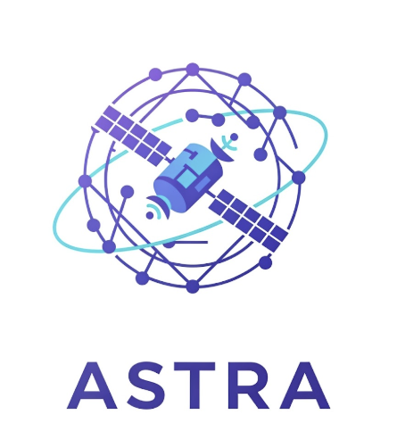
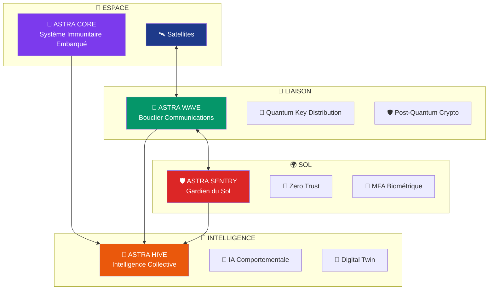

<div align="center">

# 🛡️ PROJET ASTRA



### *Framework de Cybersécurité pour Constellations de Satellites*
### **Protection en Profondeur contre les Cyberattaques Spatiales**

[](https://github.com/servais1983/projet-astra)
[](https://github.com/servais1983/projet-astra)
[](https://github.com/servais1983/projet-astra)
[](https://github.com/servais1983/projet-astra)

---

</div>

## 🎯 Mission Critique

**Projet Astra** est un écosystème de cybersécurité intégré conçu pour protéger les constellations de satellites contre les cyberattaques sophistiquées. Face à l'explosion des menaces spatiales, Astra propose une **défense en profondeur** combinant technologies de pointe et approches Zero Trust.

> *"Attaquer les satellites, ce n'est plus de la science-fiction. Il est temps de construire le bouclier."*

## 🏗️ Architecture de Défense : Les 4 Piliers

<div align="center">



</div>

## 🛡️ Pilier 1 : ASTRA SENTRY
### *Le Gardien du Segment Sol*

**Principe** : Partir du principe que le réseau est déjà compromis (Zero Trust)

### 🔧 Composants Techniques

- **🏠 Micro-segmentation Réseau**
  - Isolation drastique de chaque composant
  - Containement des attaquants en "boîtes étanches"
  - SDN (Software Defined Networking) avec policies dynamiques

- **🔐 Authentification Forte Multi-Facteurs**
  - Clés matérielles (YubiKey) + Biométrie
  - Validation croisée géographique pour commandes critiques
  - Signature cryptographique des ordres

- **💻 Terminaux Opérateurs Durcis**
  - Boot vérifié et signé
  - Environnement minimal (pas de web/mail)
  - Logging intégral des interactions

## 📶 Pilier 2 : ASTRA WAVE
### *Le Bouclier des Communications*

**Innovation** : Cryptographie post-quantique et détection IA des anomalies

### 🔧 Technologies Avancées

- **🔮 Cryptographie Post-Quantique (PQC)**
  ```
  ✅ CRYSTALS-Kyber    → Échange de clés
  ✅ CRYSTALS-Dilithium → Signatures numériques
  ✅ Résistance quantique → Protection future
  ```

- **⚛️ Quantum Key Distribution (QKD)**
  - Liens fibres critiques entre stations
  - Détection automatique des écoutes
  - Sécurité physique quantique

- **🤖 IA Analyse Comportementale**
  - Apprentissage des "empreintes" RF légitimes
  - Détection temps réel du jamming/spoofing
  - Corrélation multi-spectrale

## 🧠 Pilier 3 : ASTRA CORE
### *Le Système Immunitaire Embarqué*

**Mission** : Protection autonome à bord du satellite

### 🔧 Composants Critiques

- **🔍 µAgent de Surveillance**
  ```rust
  // Agent minimal en Rust/Ada
  - Vérification intégrité mémoire
  - Contrôle checksums firmware
  - Détection modifications critiques
  ```

- **💓 Heartbeat Cryptographique**
  - Défi-réponse permanent avec stations sol
  - Validation d'authenticité continue
  - Protocole anti-replay

- **🏰 Mode Sanctuaire Autonome**
  - Activation sur détection de compromission
  - Isolation complète sauf fréquence d'urgence
  - Orientation panneaux solaires survie

## 🐝 Pilier 4 : ASTRA HIVE
### *L'Intelligence Collective*

**Rôle** : SIEM spatial avec IA et corrélation multi-domaines

### 🔧 Capacités Avancées

- **🔗 Corrélation Événements Multi-Domaines**
  - Fusion logs Sol + Liaison + Satellite
  - Détection patterns d'attaque complexes
  - Timeline reconstruction automatique

- **👥 Jumeau Numérique Cybersécurité**
  - Réplique virtuelle constellation complète
  - Simulation attaques avant déploiement
  - Validation patches en environnement sûr

- **🎯 Threat Intelligence Spatiale**
  - Base signatures attaques connues
  - IOCs (Indicators of Compromise) spatiaux
  - Partage communauté sécurisée

## ⚔️ Matrice des Menaces

<table>
<tr><th>Surface d'Attaque</th><th>Vecteurs</th><th>Impact</th><th>Protection Astra</th></tr>
<tr>
<td><strong>🌍 Segment Sol</strong></td>
<td>Phishing, Malware, Supply Chain</td>
<td>Prise contrôle commandes</td>
<td>🛡️ ASTRA SENTRY</td>
</tr>
<tr>
<td><strong>📡 Liaisons</strong></td>
<td>Jamming, Spoofing, Eavesdropping</td>
<td>Déni service, Injection</td>
<td>📶 ASTRA WAVE</td>
</tr>
<tr>
<td><strong>🛰️ Satellite</strong></td>
<td>Zero-day RTOS, Side-Channel</td>
<td>Bricking, Weaponization</td>
<td>🧠 ASTRA CORE</td>
</tr>
</table>

## 🔐 Sécurité d'Astra Lui-Même

### DevSecOps Spatial
- **🔍 Vérification Formelle** : Preuve mathématique du code
- **📦 Supply Chain Auditée** : Dépendances signées et isolées
- **🚨 Red Team Continu** : Pentesting permanent interne

### Architecture Décentralisée
- **🌐 Federated Learning** : IA distribuée, pas de point unique
- **🏦 HSM Multi-Sites** : Clés racines géographiquement séparées
- **👥 Validation Humaine** : "Homme mort" physique pour actions critiques

## 🛠️ Stack Technologique

<div align="center">

| Layer | Technologies | Justification |
|-------|-------------|---------------|
| **🔐 Crypto** | CRYSTALS-Kyber/Dilithium | Résistance quantique |
| **🧠 IA/ML** | TensorFlow/PyTorch, ONNX | Détection comportementale |
| **🌐 Réseau** | eBPF, P4, OpenFlow | Micro-segmentation avancée |
| **🛡️ Sécurité** | HashiCorp Vault, PKCS#11 | Gestion secrets/HSM |
| **📊 Monitoring** | Elastic Stack, Grafana | SIEM et visualisation |
| **🚀 Embarqué** | Rust, Ada SPARK | Sûreté critique |

</div>

## 📈 Roadmap de Développement

### Phase 1 : Fondations (Q1-Q2)
- [x] 🏗️ Architecture ASTRA HIVE
- [x] 👥 Digital Twin MVP
- [ ] 🧪 Laboratoire de simulation
- [ ] 📊 Modèles IA comportementale

### Phase 2 : Intégration (Q3-Q4)
- [ ] 🛡️ Déploiement ASTRA SENTRY
- [ ] 📶 Prototype ASTRA WAVE
- [ ] 🔐 Implémentation PQC
- [ ] ⚛️ Tests QKD

### Phase 3 : Embarqué (Année 2)
- [ ] 🧠 Développement ASTRA CORE
- [ ] 🛰️ Tests en environnement spatial
- [ ] 🚨 Red Team spatial
- [ ] 📜 Certification spatiale

## 🏆 Certifications & Standards

- **🛰️ CCSDS (Space Standards)**
- **🛡️ ISO 27001/27002**
- **🏛️ NIST Cybersecurity Framework**
- **🌍 ECSS (European Space Standards)**
- **🔐 Common Criteria EAL 5+**

## 🤝 Contribution & Red Team

### Comment Contribuer
1. **🍴 Fork** le repository
2. **🌿 Branch** : `git checkout -b feature/defense-module`
3. **💻 Code** avec tests et documentation
4. **🔍 Security Review** obligatoire
5. **📤 Pull Request** avec threat model

### Programme Red Team
**Nous payons pour être hackés !** 💰
- 🏆 Bug Bounty interne permanent
- 🎯 Scénarios d'attaque réalistes
- 📋 Reporting détaillé requis
- 🛡️ Amélioration continue

## 📊 Métriques de Sécurité

- **🎯 MTTR** : <15 minutes détection → réponse
- **🔍 Coverage** : 99.9% événements sécurité loggés
- **🚨 False Positives** : <1% alertes IA
- **🛡️ Resilience** : Survie à 3 compromissions simultanées
- **⚡ Performance** : <100ms latence ajoutée

## 🌟 Cas d'Usage

- **🛰️ Opérateurs Satellites** : Starlink, OneWeb, etc.
- **🏛️ Agences Spatiales** : ESA, NASA, CNES
- **🛡️ Défense Nationale** : Satellites militaires
- **🏢 Entreprises** : IoT spatial, Earth Observation
- **🎓 Recherche** : Laboratoires cybersécurité spatiale

## 🆘 Support d'Urgence

<div align="center">

**🚨 INCIDENT SPATIAL 24/7 🚨**

📞 **Hotline Sécurité** : +33 (0) 1 XX XX XX XX  
📧 **Email Urgence** : security@projet-astra.space  
🔐 **PGP Key** : `0xASTRA2025SECURITY`

⚡ **Temps de Réponse Garanti** : 15 minutes maximum

</div>

## 📚 Documentation Technique

- 📖 [Architecture Détaillée](./docs/architecture.md)
- 🔐 [Threat Model Complet](./docs/threat-model.md)
- 🧪 [Guide de Test](./docs/testing.md)
- 🚀 [Déploiement Production](./docs/deployment.md)
- 🔧 [API Reference](./docs/api.md)
- 🎓 [Formation Opérateurs](./docs/training.md)

## 📄 Licence & Conformité

- **📋 Licence** : Apache 2.0 (avec clauses export control)
- **🌍 ITAR Compliant** : Restrictions d'export appliquées
- **🔐 Crypto Export** : Déclaration préalable requise
- **🏛️ Open Source** : Code core en libre (sauf modules classifiés)

---

<div align="center">

## 🚀 Prêt à Poser la Première Brique ?

*"Dans l'espace, personne ne peut vous entendre hacker... sauf Astra."*

[](./docs/quickstart.md)
[](mailto:team@projet-astra.space)
[](mailto:security@projet-astra.space)

**Made with 🛡️ for Spatial Security**

⭐ **Star ce repo pour soutenir la cybersécurité spatiale !**

</div>
